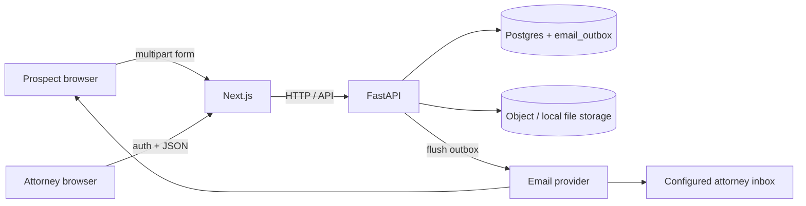

# Design (Human)

## Functional requirements

- Public facing page. A form where prospects can fill in f/l name, email, and upload a CV
  - Requires the ability to store file somewhere.
  - Verification/processing/virus checking the file is out of scope.
- Some notion of account creation. The only account type in scope is for attorneys who can view and manage prospects.
- Internal UI for viewing prospects. 
  - Authed. Username/pass is sufficient for now. 
  - Data table view of prospects.

## Non-functional requirements

- Local-runnable E2E: one command path to boot API + web + dependencies.
- Auth on all attorney-facing APIs; public form has no auth.
- Durable persistence for leads, resume files, and user accounts.
- Email delivery is best-effort after the lead is persisted (failure to send must not lose the lead).
- Scalability: design for a small firm / takehome load; keep seams (object storage, email provider interfaces) so production swaps are possible without rewriting core flows.

## Assumptions

1. **Attorney notification:** email a single configured firm inbox / attorney address (`ATTORNEY_NOTIFY_EMAIL`), not every attorney. No round-robin assignment in v1.
2. **Ownership:** no lead ownership model in v1. Any authenticated attorney can view leads and mark `REACHED_OUT`.
3. **States:** only `PENDING` and `REACHED_OUT`, matching the problem statement.
4. **Duplicates:** allow multiple submissions from the same email (each is a new lead). Deduping is out of scope.
5. **Accounts:** users with `account_type = ATTORNEY` are created out-of-band (dev: `backend/scripts/dev_seed.py`); no public self-signup.
6. **Updates:** attorneys can update lead state (`PENDING` → `REACHED_OUT`). Prospect field edits after submit are out of scope.

# Design (Human + AI)

## High level design

### Overview

Two surfaces share one FastAPI backend:


| Surface          | Who      | Purpose                                          |
| ---------------- | -------- | ------------------------------------------------ |
| Public intake    | Prospect | Submit name, email, resume → create lead         |
| Internal console | Attorney | Login, list leads, open resume, mark reached out |





### Components

1. **Next.js (App Router)**
  - `/` — public lead form (client upload to API).
  - `/login` — attorney login.
  - `/leads` — authenticated table of leads; action to mark `REACHED_OUT`; link/download resume.
  - Talks only to FastAPI (no business logic in Next route handlers beyond proxying if needed for cookies/CORS).
2. **FastAPI**
  - Public: `POST /leads` (multipart: fields + resume file).
  - Auth: `POST /auth/login` (username/password → server-side session + HTTP-only cookie); `POST /auth/logout` deletes the session.
  - Protected: `GET /leads`, `PATCH /leads/{id}` (state transition), `GET /leads/{id}/resume` — resolve session cookie → `sessions` row → `users` (require `account_type = ATTORNEY`).
  - On successful create: persist lead + enqueue two email outbox rows (same DB transaction), then flush pending outbox for that lead (sync in-request is OK for takehome).
  - Layering: routers → services → repositories / storage / email clients (production-shaped, thin handlers).
3. **Postgres**
  - `users` — credentials (password hashed), `display_name`, `account_type` (v1: `ATTORNEY` only).
  - `sessions` — server-side session rows (cookie holds session id only).
  - `leads` — prospect fields, `status`, resume **storage key** (object key only) + file metadata, timestamps. Bucket name is never stored on the lead.
  - `email_outbox` — durable outbound email intents (template id + data + recipient + status); details in [Database schema](#database-schema).
4. **File storage**
  - Store resume bytes under a stable key (e.g. `leads/{id}/resume.pdf`). Persist that key in `leads.resume_storage_key` — **key only, never bucket**.
  - Bucket comes from config (`S3_BUCKET` / env), not from the DB.
  - Local MinIO (S3-compatible) via `docker compose`; interface allows real S3 later.
  - No virus scanning / content inspection (out of scope).
5. **Email**
  - **Transactional outbox:** create handler enqueues rows in `email_outbox` (not a direct Resend call from the handler). A sender (same-process flush after commit, or a small in-process loop) reads pending rows and calls Resend.
  - Provider behind an interface; **Resend** is the chosen implementation (external API — no local mail container).
  - Dev: console/log sink or provider test mode so E2E works without real mail if keys missing.
  - Two messages on create: prospect confirmation, attorney alert (includes lead summary; resume via internal UI, not necessarily attached).
  - Send failures update the outbox row (`FAILED` / increment `attempts`); the lead always remains.

#### Email templating (Resend-hosted)

Templates live in the **Resend dashboard** (Resend-hosted templates), not as Jinja2 or HTML files in this repo. The backend does not render email bodies; it stores and sends a **template id + template data** (variables).

| Template | Outbox `kind` | Purpose | Env var (template id) |
| --- | --- | --- | --- |
| Prospect confirmation | `PROSPECT_CONFIRMATION` | Ack to the submitting prospect | `RESEND_TEMPLATE_PROSPECT_CONFIRMATION` |
| Attorney new-lead notification | `ATTORNEY_NEW_LEAD` | Alert the configured firm inbox | `RESEND_TEMPLATE_ATTORNEY_NEW_LEAD` |

**Enqueue (create path):** map lead → resolve template id from env → insert outbox row with `(kind, to_email, template_id, template_data)`. No in-app HTML/Jinja2 rendering.

**Send (outbox flusher):** for each pending row → Resend send API with stored `template_id` + `template_data` + `to_email`. Apply `FROM_EMAIL` from env at send time (not stored per row in v1).

**Env vars:** `RESEND_API_KEY`, `FROM_EMAIL`, `ATTORNEY_NOTIFY_EMAIL`, plus the two template ids above (see `.env.example`).

**Suggested template variables** (document in Resend when creating templates; keep names aligned here):

| Variable | Prospect confirm | Attorney notify | Notes |
| --- | --- | --- | --- |
| `first_name` | ✓ | ✓ | From lead |
| `last_name` | ✓ | ✓ | From lead |
| `email` | ✓ | ✓ | Prospect email |
| `lead_id` | ✓ | ✓ | New lead UUID (string) |
| `resume_original_filename` | — | ✓ | Optional; resume itself via internal UI |

**Tradeoff:** template HTML/copy is **not versioned in the repo**. Required variable names are documented here so implementers and dashboard templates stay aligned. Change copy in Resend; change variable contracts only with a coordinated backend + DESIGN update.

### Core flows

**Submit lead (public)**

1. Prospect submits form → Next → `POST /leads`.
2. API validates fields + file type/size basics.
3. Allocate lead `id` (UUID in app), upload resume to MinIO at `leads/{id}/resume…`. If upload fails → abort; no DB writes.
4. In **one DB transaction:** insert `leads` row (`PENDING`) + two `email_outbox` rows (`PROSPECT_CONFIRMATION`, `ATTORNEY_NEW_LEAD`) with resolved `template_id` / `template_data` / `to_email`, status `PENDING`. If this transaction fails after a successful upload, an orphan object in MinIO is acceptable for the takehome (no compensating delete required in v1).
5. After commit: flush pending outbox for this lead (sync in-request is OK): sender reads each row → Resend; on success mark `SENT` + `sent_at`; on failure increment `attempts`, set `last_error`, mark `FAILED`. **Lead is never rolled back for email failure.**
6. Return success to prospect.

**Attorney review**

1. Login → server-side session (cookie + `sessions` row).
2. `GET /leads` → table (newest first).
3. Download resume via authenticated endpoint.
4. `PATCH` status to `REACHED_OUT` when they have contacted the prospect.

### Auth (v1)

Server-side sessions only — **no JWT**, no signed/stateless session cookies.

- Username + password for attorney users only (login uses `username`, not `display_name`). Password hashes live on `users`; `display_name` is for UI (e.g. greetings).
- **Store:** Postgres `sessions` table. Cookie value is the session id only (opaque UUID); the server loads the row on each protected request.
- **Cookie:** HTTP-only; `Secure` in production; `SameSite` appropriate for the API/frontend origin setup. Next calls API with credentials.
- **Login:** verify password → insert `sessions` row (`id`, `user_id`, `expires_at`, `created_at`) → `Set-Cookie` with session id.
- **Logout:** delete (or invalidate) the `sessions` row → clear cookie.
- **Protected routes:** read cookie → load non-expired session → load user → require `account_type = ATTORNEY`. Reject missing/expired/unknown sessions.
- Protect all non-public lead/resume routes; public create stays open.

### Database schema

Postgres (`alma` DB via compose). SQLAlchemy models + Alembic migrations own the schema; the initial migration creates the tables below. Object bytes live in the configured MinIO/S3 bucket (`S3_BUCKET`, e.g. `lead-files` in `.env.example`) — a generic lead-files bucket (resumes today; keys still e.g. `leads/{id}/resume.pdf`). The DB stores the **object key only** (`resume_storage_key`) plus download metadata — **never the bucket name**.

#### Enum types

Recommend **Postgres native `ENUM`s**, mapped in SQLAlchemy as `Enum(..., native_enum=True)`.

**`lead_status`** — values `PENDING` | `REACHED_OUT` (`Enum(LeadStatus, name="lead_status", native_enum=True)`).

- Fits a closed, problem-defined set; column stays typed in both SQL and Python.
- Default on insert: `PENDING`.
- Tradeoff: adding a new status later needs an Alembic `ALTER TYPE … ADD VALUE` (acceptable for v1; we are not planning extra states).
- Alternative considered: `VARCHAR` + `CHECK` — slightly easier to evolve in migrations, slightly looser at the DB layer. Prefer native enum unless we reopen lifecycle states.

**`account_type`** — values `ATTORNEY` only in v1 (`Enum(AccountType, name="account_type", native_enum=True)`). SCREAMING_SNAKE to match `lead_status`.

- Typed for future roles without a schema rename; v1 seed and auth assume attorney users only.
- Tradeoff: same `ALTER TYPE … ADD VALUE` cost when adding roles later (acceptable).

**`email_outbox_kind`** — values `PROSPECT_CONFIRMATION` | `ATTORNEY_NEW_LEAD`.

- Distinguishes purpose for debugging / queries; complements stored `template_id` (resolved from env at enqueue).

**`email_outbox_status`** — values `PENDING` | `SENT` | `FAILED`.

- Worker / flush path claims `PENDING` rows; terminal outcomes are `SENT` or `FAILED`. Retries beyond a simple in-request flush are out of scope for v1 (can re-process `FAILED` later if needed).

#### Tables

**`users`** — seeded accounts only (no self-signup). v1 seed creates attorney users (`account_type = ATTORNEY`).

| Column | Type | Null | Default | Notes |
| --- | --- | --- | --- | --- |
| `id` | `UUID` | NO | `gen_random_uuid()` | PK |
| `username` | `VARCHAR(64)` | NO | — | Unique; used for login (case-sensitive as stored; normalize in app if desired) |
| `password_hash` | `VARCHAR(255)` | NO | — | Hash only — never store plaintext. Prefer **argon2id** (or bcrypt) via a well-maintained lib (e.g. `pwdlib` / `passlib`); verify on login |
| `display_name` | `VARCHAR(100)` | NO | — | UI only (e.g. greetings); not used for login |
| `account_type` | `account_type` | NO | — | v1: `ATTORNEY` only; enum typed for future expansion |
| `created_at` | `TIMESTAMPTZ` | NO | `now()` | |

Indexes / constraints:

- `PRIMARY KEY (id)`
- `UNIQUE (username)`

**`sessions`** — server-side auth sessions. Cookie holds `id` only (opaque UUID); no JWT or signed payload in the cookie.

| Column | Type | Null | Default | Notes |
| --- | --- | --- | --- | --- |
| `id` | `UUID` | NO | `gen_random_uuid()` | PK; opaque session token placed in the cookie |
| `user_id` | `UUID` | NO | — | FK → `users.id` |
| `expires_at` | `TIMESTAMPTZ` | NO | — | Reject (and preferably delete) when past |
| `created_at` | `TIMESTAMPTZ` | NO | `now()` | |

Indexes / constraints:

- `PRIMARY KEY (id)`
- `FOREIGN KEY (user_id) REFERENCES users (id)`
- Index `ix_sessions_user_id` on `(user_id)` (optional; useful for “log out everywhere” later)
- Index `ix_sessions_expires_at` on `(expires_at)` for expiry cleanup

**`leads`** — one row per submission; same email may appear many times.

| Column | Type | Null | Default | Notes |
| --- | --- | --- | --- | --- |
| `id` | `UUID` | NO | `gen_random_uuid()` | PK |
| `first_name` | `VARCHAR(100)` | NO | — | Immutable after create (API enforces) |
| `last_name` | `VARCHAR(100)` | NO | — | Immutable after create |
| `email` | `VARCHAR(320)` | NO | — | RFC-ish max; **no unique constraint** (duplicates allowed) |
| `status` | `lead_status` | NO | `'PENDING'` | Only attorney `PATCH` may change → `REACHED_OUT` |
| `resume_storage_key` | `VARCHAR(512)` | NO | — | **Key only, never bucket.** Object key within `S3_BUCKET` (e.g. `leads/{id}/resume.pdf`) |
| `resume_original_filename` | `VARCHAR(255)` | NO | — | For `Content-Disposition` / UI label |
| `resume_content_type` | `VARCHAR(127)` | NO | — | e.g. `application/pdf` |
| `resume_size_bytes` | `BIGINT` | NO | — | Validated against upload limit at create |
| `created_at` | `TIMESTAMPTZ` | NO | `now()` | List sorts newest-first |
| `updated_at` | `TIMESTAMPTZ` | NO | `now()` | Bump on status change |

Indexes / constraints:

- `PRIMARY KEY (id)`
- Index `ix_leads_created_at` on `(created_at DESC)` for attorney list
- No FK to `users` (no ownership in v1)
- No unique on `email`

**`email_outbox`** — durable outbound email intents; both v1 emails are lead-triggered.

| Column | Type | Null | Default | Notes |
| --- | --- | --- | --- | --- |
| `id` | `UUID` | NO | `gen_random_uuid()` | PK |
| `lead_id` | `UUID` | NO | — | FK → `leads.id`; NOT NULL in v1 (both kinds are lead-triggered) |
| `kind` | `email_outbox_kind` | NO | — | `PROSPECT_CONFIRMATION` \| `ATTORNEY_NEW_LEAD` |
| `to_email` | `VARCHAR(320)` | NO | — | Recipient (prospect email or `ATTORNEY_NOTIFY_EMAIL`) |
| `template_id` | `VARCHAR(128)` | NO | — | Resend template id, resolved from env at enqueue |
| `template_data` | `JSONB` | NO | — | Variables Resend accepts (see Email templating) |
| `status` | `email_outbox_status` | NO | `'PENDING'` | `PENDING` → `SENT` \| `FAILED` |
| `attempts` | `INT` | NO | `0` | Incremented on each send attempt |
| `last_error` | `TEXT` | YES | — | Last provider / send error message |
| `created_at` | `TIMESTAMPTZ` | NO | `now()` | Enqueue time |
| `sent_at` | `TIMESTAMPTZ` | YES | — | Set when status becomes `SENT` |
| `updated_at` | `TIMESTAMPTZ` | NO | `now()` | Bump on status / attempt changes |

Indexes / constraints:

- `PRIMARY KEY (id)`
- `FOREIGN KEY (lead_id) REFERENCES leads (id)`
- Index `ix_email_outbox_pending` on `(status, created_at)` for worker / flush (pending-first; partial index `WHERE status = 'PENDING'` is fine if preferred)

`FROM_EMAIL` is **not** stored per row; the sender applies it from env at send time.

#### Resume storage: key only (+ metadata)

On the lead row store:

- `resume_storage_key` — **object key only; never store the bucket** (bucket = `S3_BUCKET` / env).
- `resume_original_filename`, `resume_content_type`, `resume_size_bytes` — download/UI metadata so the API can set headers and the console can show filename/size without a MinIO `HEAD`.

One resume per lead (columns on `leads`); no separate `files` table in v1.

#### Illustrative DDL sketch

```sql
CREATE TYPE lead_status AS ENUM ('PENDING', 'REACHED_OUT');
CREATE TYPE account_type AS ENUM ('ATTORNEY');
CREATE TYPE email_outbox_kind AS ENUM ('PROSPECT_CONFIRMATION', 'ATTORNEY_NEW_LEAD');
CREATE TYPE email_outbox_status AS ENUM ('PENDING', 'SENT', 'FAILED');

CREATE TABLE users (
  id            UUID PRIMARY KEY DEFAULT gen_random_uuid(),
  username      VARCHAR(64)  NOT NULL UNIQUE,
  password_hash VARCHAR(255) NOT NULL,
  display_name  VARCHAR(100) NOT NULL,
  account_type  account_type NOT NULL,
  created_at    TIMESTAMPTZ  NOT NULL DEFAULT now()
);

CREATE TABLE sessions (
  id         UUID PRIMARY KEY DEFAULT gen_random_uuid(),
  user_id    UUID NOT NULL REFERENCES users (id),
  expires_at TIMESTAMPTZ NOT NULL,
  created_at TIMESTAMPTZ NOT NULL DEFAULT now()
);

CREATE INDEX ix_sessions_user_id ON sessions (user_id);
CREATE INDEX ix_sessions_expires_at ON sessions (expires_at);

CREATE TABLE leads (
  id                       UUID PRIMARY KEY DEFAULT gen_random_uuid(),
  first_name               VARCHAR(100)  NOT NULL,
  last_name                VARCHAR(100)  NOT NULL,
  email                    VARCHAR(320)  NOT NULL,
  status                   lead_status   NOT NULL DEFAULT 'PENDING',
  resume_storage_key       VARCHAR(512)  NOT NULL,  -- key only; bucket from S3_BUCKET env
  resume_original_filename VARCHAR(255)  NOT NULL,
  resume_content_type      VARCHAR(127)  NOT NULL,
  resume_size_bytes        BIGINT        NOT NULL,
  created_at               TIMESTAMPTZ   NOT NULL DEFAULT now(),
  updated_at               TIMESTAMPTZ   NOT NULL DEFAULT now()
);

CREATE INDEX ix_leads_created_at ON leads (created_at DESC);

CREATE TABLE email_outbox (
  id             UUID PRIMARY KEY DEFAULT gen_random_uuid(),
  lead_id        UUID NOT NULL REFERENCES leads (id),
  kind           email_outbox_kind NOT NULL,
  to_email       VARCHAR(320) NOT NULL,
  template_id    VARCHAR(128) NOT NULL,
  template_data  JSONB NOT NULL,
  status         email_outbox_status NOT NULL DEFAULT 'PENDING',
  attempts       INT NOT NULL DEFAULT 0,
  last_error     TEXT,
  created_at     TIMESTAMPTZ NOT NULL DEFAULT now(),
  sent_at        TIMESTAMPTZ,
  updated_at     TIMESTAMPTZ NOT NULL DEFAULT now()
);

CREATE INDEX ix_email_outbox_pending ON email_outbox (status, created_at);
```

(`gen_random_uuid()` is built into Postgres 13+; image is `postgres:16-alpine`.)

#### Migrations

- Alembic owns schema evolution under `backend/` (exact layout when scaffolding).
- First revision: create `lead_status` + `account_type` + `email_outbox_kind` + `email_outbox_status` enums + `users` + `sessions` + `leads` + `email_outbox` (+ indexes).
- Seed attorney users out-of-band (script or env-driven bootstrap), not via migration data dumps if avoidable.

#### Deliberately omitted from the schema

- Lead ownership / `assigned_attorney_id`
- Soft delete / `deleted_at`
- Separate resume/files table
- Resume bucket column (bucket is `S3_BUCKET` / env only; DB has `resume_storage_key` — key only)
- JWT / refresh-token / signed-cookie auth tables (v1 uses Postgres `sessions` only)
- Audit log of status transitions
- Unique constraint on lead email
- Per-row `from_email` on outbox (`FROM_EMAIL` env at send time)
- Outbox retry / dead-letter scheduling beyond `attempts` + `FAILED`

### API surface (sketch)


| Method  | Path                 | Auth     | Notes                                              |
| ------- | -------------------- | -------- | -------------------------------------------------- |
| `POST`  | `/leads`             | public   | multipart create                                   |
| `POST`  | `/auth/login`        | public   | creates `sessions` row + Set-Cookie (session id)   |
| `POST`  | `/auth/logout`       | attorney | deletes session row + clears cookie                |
| `GET`   | `/leads`             | attorney | list; session cookie → user (`ATTORNEY`)           |
| `PATCH` | `/leads/{id}`        | attorney | `{ "status": "REACHED_OUT" }`                      |
| `GET`   | `/leads/{id}/resume` | attorney | stream file via `resume_storage_key` + `S3_BUCKET` |


### Repo shape (target)

```
/
  docs/              PROBLEM, DESIGN, RUN, AGENT notes
  frontend/          Next.js
  backend/           FastAPI app, tests, migrations
  docker-compose.yml Postgres + MinIO (local); email via Resend API
  .env.example       DB / MinIO / Resend vars
```

### Deliberate non-goals (v1)

- Lead assignment / ownership / round-robin
- Extra lifecycle states beyond `PENDING` / `REACHED_OUT`
- Duplicate email detection
- Virus scanning, OCR, resume parsing
- Multi-tenant firms, RBAC beyond “attorney”
- Separate async job queue (Redis/Celery/RQ, etc.). Transactional outbox + same-process flush after commit is in scope; a dedicated worker process can wait until email latency matters

# Pending Questions

1. When a lead is submitted, which attorney gets the email? One or all? If one, how are they chosen? Round robin or based on their availability?
2. Typically with a system like this, a specific attorney will "own" a case. Should this be represented in the UX, or should any attorney be able to take a case and mark as "reached out"?
3. Are the only states for a case "pending" and "reached out"? How about "active", "closed" or "rejected" too?
4. Do we handle duplicate submissions?

