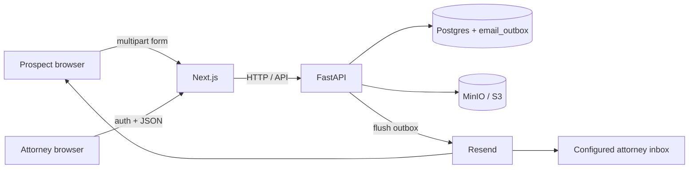

# Design

## Functional requirements

- Public facing page. A form where prospects can fill in f/l name, email, and upload a CV
  - Requires the ability to store file somewhere.
  - Verification/processing/virus checking the file is out of scope.
- Some notion of account creation. The only account type in scope is for attorneys who can view and manage prospects.
- Internal UI for viewing prospects.
  - Authed. Username/pass is sufficient for now.
  - Data table view of prospects, plus a detail view for resume and status updates.

## Non-functional requirements

- Local-runnable E2E: `docker compose up --build` runs Postgres, MinIO, FastAPI, and Next.js.
- Auth on all attorney-facing APIs; public form has no auth.
- Durable persistence for leads, resume files, and user accounts.
- Email delivery is best-effort after the lead is persisted (failure to send must not lose the lead).
- Scalability: design for a small firm / takehome load; keep seams (object storage, email provider) so production swaps are possible without rewriting core flows.

## Assumptions

1. **Attorney notification:** email a single configured firm inbox (`ATTORNEY_NOTIFY_EMAIL`), not every attorney. No round-robin assignment. If `ATTORNEY_NOTIFY_EMAIL` is empty, skip the attorney new-lead email (still enqueue prospect confirmation).
2. **Ownership:** no lead ownership model. Any authenticated attorney can view leads and mark `REACHED_OUT`.
3. **States:** only `PENDING` and `REACHED_OUT`.
4. **Duplicates:** allow multiple submissions from the same email (each is a new lead). Deduping is out of scope.
5. **Accounts:** users with `account_type = ATTORNEY` are created out-of-band (dev: `backend/scripts/dev_seed.py`); no public self-signup.
6. **Updates:** attorneys can update lead state (`PENDING` → `REACHED_OUT`). Prospect field edits after submit are out of scope.

## High level design

### Overview

Two surfaces share one FastAPI backend:

| Surface          | Who      | Purpose                                          |
| ---------------- | -------- | ------------------------------------------------ |
| Public intake    | Prospect | Submit name, email, resume → create lead         |
| Internal console | Attorney | Login, list leads, open resume, mark reached out |



### Components

1. **Next.js (App Router)**
  - `/` — blank landing placeholder.
  - `/get-started` — public lead form (client upload to API).
  - `/admin/login` — attorney login.
  - `/admin/dashboard/leads` — authenticated table (offset pagination + optional status filter).
  - `/admin/dashboard/leads/[id]` — lead detail; mark `REACHED_OUT`; PDF preview via short-lived resume URL.
  - Browser calls FastAPI directly with `credentials: "include"` (no Next BFF/proxy).

2. **FastAPI**
  - Public: `POST /leads` (multipart: fields + resume file).
  - Auth: `POST /auth/login` (username/password → server-side session + HTTP-only cookie); `POST /auth/logout`; `GET /auth/me`.
  - Protected: `GET /leads`, `GET /leads/{id}`, `PATCH /leads/{id}`, `GET /leads/{id}/resume` — session cookie → `sessions` → `users` (require `account_type = ATTORNEY`).
  - On create: persist lead + enqueue outbox row(s) in one DB transaction, then flush pending outbox for that lead (sync in-request).
  - Layering: routers → services → storage / email clients.

3. **Postgres**
  - `users` — credentials (password hashed), `display_name`, `account_type` (`ATTORNEY` only).
  - `sessions` — server-side session rows (cookie holds session id only).
  - `leads` — prospect fields, `status`, resume **storage key** (object key only) + file metadata, timestamps. Bucket name is never stored on the lead.
  - `email_outbox` — durable outbound email intents (template id + data + recipient + status).

4. **File storage**
  - Store resume bytes under a stable key (e.g. `leads/{id}/resume.pdf`). Persist that key in `leads.resume_storage_key` — **key only, never bucket**.
  - Bucket from config (`S3_BUCKET` / env).
  - Local MinIO (S3-compatible) via `docker compose`.
  - No virus scanning / content inspection.
  - App enforces `RESUME_MAX_BYTES` on create; production should also enforce upload size at the reverse proxy.
  - Attorney resume access uses **presigned GET URLs** (TTL **300 seconds**), returned as `resume_url` on lead detail and via `GET /leads/{id}/resume`.
  - Uploads use `S3_ENDPOINT` (Docker: `http://minio:9000`). Presigned URLs use `S3_PUBLIC_ENDPOINT` when set (Docker: `http://localhost:9000`) so the browser can fetch objects.

5. **Email**
  - **Transactional outbox:** create path enqueues rows in `email_outbox`. After commit, a same-process flush sends pending rows via Resend.
  - Always enqueue prospect confirmation. Enqueue attorney alert only when `ATTORNEY_NOTIFY_EMAIL` is set.
  - Attorney template data includes a dashboard link built from `PUBLIC_URL`.
  - Send failures mark the outbox row `FAILED`; the lead always remains.
  - Missing `RESEND_API_KEY` causes send failure (logged); lead is still kept.

#### Email templating (Resend-hosted)

Templates live in the Resend dashboard. The backend does not render HTML; it stores and sends a **template id + template data**.

Template ids are **hardcoded** in the backend:

| Template | Outbox `kind` | Template id | Purpose |
| --- | --- | --- | --- |
| Prospect confirmation | `PROSPECT_CONFIRMATION` | `request-received` | Ack to the submitting prospect |
| Attorney new-lead notification | `ATTORNEY_NEW_LEAD` | `new-lead` | Alert the configured firm inbox |

**Template variables**

| Variable | Prospect confirm | Attorney notify | Notes |
| --- | --- | --- | --- |
| `LEAD_FIRST_NAME` | ✓ | — | Prospect first name |
| `first_name` | — | ✓ | From lead |
| `last_name` | — | ✓ | From lead |
| `email` | — | ✓ | Prospect email |
| `dashboard_url` | — | ✓ | `{PUBLIC_URL}/admin/dashboard/leads/{lead_id}` |

**Env vars:** `RESEND_API_KEY`, `FROM_EMAIL`, `ATTORNEY_NOTIFY_EMAIL`, `PUBLIC_URL` (see root `.env.example`).

### Core flows

**Submit lead (public)**

1. Prospect submits form → `POST /leads`.
2. API validates fields + file type/size basics (`.pdf` / `.docx`, max `RESUME_MAX_BYTES`).
3. Allocate lead `id` (UUID), upload resume to object storage at `leads/{id}/resume…`. If upload fails → abort; no DB writes.
4. In **one DB transaction:** insert `leads` row (`PENDING`) + `PROSPECT_CONFIRMATION` outbox row; if `ATTORNEY_NOTIFY_EMAIL` is set, also insert `ATTORNEY_NEW_LEAD`. If this transaction fails after a successful upload, an orphan object may remain (no compensating delete in v1).
5. After commit: flush pending outbox for this lead. On success mark `SENT`; on failure mark `FAILED`. **Lead is never rolled back for email failure.**
6. Return success to prospect.

**Attorney review**

1. Login → server-side session (cookie + `sessions` row).
2. `GET /leads` → paginated table (newest first; optional `status` filter).
3. Open lead detail → `GET /leads/{id}` (includes short-lived `resume_url`).
4. Preview PDF in-browser (or download DOCX via the URL).
5. `PATCH` status to `REACHED_OUT` when they have contacted the prospect.

### Auth

Server-side sessions only — **no JWT**.

- Username + password for attorney users (login uses `username`, not `display_name`). Passwords hashed with argon2id (`pwdlib`).
- Cookie holds opaque session UUID only; server loads the `sessions` row on each protected request.
- Cookie: HTTP-only; `Secure` configurable (`SESSION_COOKIE_SECURE`); `SameSite` from settings (default `lax`).
- Login: verify password → insert session → `Set-Cookie`.
- Logout: delete session row → clear cookie.
- Protected routes: cookie → non-expired session → user with `account_type = ATTORNEY`.

### Database schema

Postgres (`alma` via compose). SQLAlchemy models + Alembic migrations own the schema. Object bytes live in `S3_BUCKET` (e.g. `lead-files`). The DB stores the **object key only** (`resume_storage_key`) plus download metadata — never the bucket name.

#### Enum types

Postgres native enums:

- `lead_status` — `PENDING` | `REACHED_OUT`
- `account_type` — `ATTORNEY`
- `email_outbox_kind` — `PROSPECT_CONFIRMATION` | `ATTORNEY_NEW_LEAD`
- `email_outbox_status` — `PENDING` | `SENT` | `FAILED`

#### Tables

**`users`**

| Column | Type | Null | Default | Notes |
| --- | --- | --- | --- | --- |
| `id` | `UUID` | NO | `gen_random_uuid()` | PK |
| `username` | `VARCHAR(64)` | NO | — | Unique; used for login |
| `password_hash` | `VARCHAR(255)` | NO | — | Hash only |
| `display_name` | `VARCHAR(100)` | NO | — | UI only |
| `account_type` | `account_type` | NO | — | v1: `ATTORNEY` |
| `created_at` | `TIMESTAMPTZ` | NO | `now()` | |

**`sessions`**

| Column | Type | Null | Default | Notes |
| --- | --- | --- | --- | --- |
| `id` | `UUID` | NO | `gen_random_uuid()` | PK; cookie value |
| `user_id` | `UUID` | NO | — | FK → `users.id` |
| `expires_at` | `TIMESTAMPTZ` | NO | — | Reject when past |
| `created_at` | `TIMESTAMPTZ` | NO | `now()` | |

Indexes: `ix_sessions_user_id`, `ix_sessions_expires_at`.

**`leads`**

| Column | Type | Null | Default | Notes |
| --- | --- | --- | --- | --- |
| `id` | `UUID` | NO | `gen_random_uuid()` | PK |
| `first_name` | `VARCHAR(100)` | NO | — | Immutable after create |
| `last_name` | `VARCHAR(100)` | NO | — | Immutable after create |
| `email` | `VARCHAR(320)` | NO | — | No unique constraint |
| `status` | `lead_status` | NO | `'PENDING'` | Attorney `PATCH` → `REACHED_OUT` |
| `resume_storage_key` | `VARCHAR(512)` | NO | — | Key only; bucket from env |
| `resume_original_filename` | `VARCHAR(255)` | NO | — | UI / disposition |
| `resume_content_type` | `VARCHAR(127)` | NO | — | e.g. `application/pdf` |
| `resume_size_bytes` | `BIGINT` | NO | — | Validated at create |
| `created_at` | `TIMESTAMPTZ` | NO | `now()` | List sorts newest-first |
| `updated_at` | `TIMESTAMPTZ` | NO | `now()` | Bump on status change |

Indexes: `ix_leads_created_at` on `(created_at DESC)`; `ix_leads_status_created_at` on `(status, created_at DESC)`.

**`email_outbox`**

| Column | Type | Null | Default | Notes |
| --- | --- | --- | --- | --- |
| `id` | `UUID` | NO | `gen_random_uuid()` | PK |
| `lead_id` | `UUID` | NO | — | FK → `leads.id` |
| `kind` | `email_outbox_kind` | NO | — | Prospect or attorney |
| `to_email` | `VARCHAR(320)` | NO | — | Recipient |
| `template_id` | `VARCHAR(128)` | NO | — | Hardcoded Resend template id at enqueue |
| `template_data` | `JSONB` | NO | — | Template variables |
| `status` | `email_outbox_status` | NO | `'PENDING'` | `PENDING` → `SENT` \| `FAILED` |
| `attempts` | `INT` | NO | `0` | Incremented per send attempt |
| `last_error` | `TEXT` | YES | — | Last send error |
| `created_at` | `TIMESTAMPTZ` | NO | `now()` | |
| `sent_at` | `TIMESTAMPTZ` | YES | — | Set when `SENT` |
| `updated_at` | `TIMESTAMPTZ` | NO | `now()` | |

Index: `ix_email_outbox_pending` on `(status, created_at)`.

`FROM_EMAIL` is applied at send time from settings; not stored per row.

#### Deliberately omitted from the schema

- Lead ownership / `assigned_attorney_id`
- Soft delete / `deleted_at`
- Separate resume/files table
- Resume bucket column
- JWT / refresh-token tables
- Audit log of status transitions
- Unique constraint on lead email
- Outbox retry scheduling beyond `attempts` + `FAILED`

### API surface

| Method  | Path                 | Auth     | Notes |
| ------- | -------------------- | -------- | ----- |
| `POST`  | `/leads`             | public   | multipart create |
| `POST`  | `/auth/login`        | public   | session cookie |
| `POST`  | `/auth/logout`       | attorney | delete session + clear cookie |
| `GET`   | `/auth/me`           | attorney | current user |
| `GET`   | `/leads`             | attorney | offset page: `page`, `page_size`, optional `status` |
| `GET`   | `/leads/{id}`        | attorney | detail + short-lived `resume_url` |
| `PATCH` | `/leads/{id}`        | attorney | `{ "status": "REACHED_OUT" }` |
| `GET`   | `/leads/{id}/resume` | attorney | `{ url, filename, content_type, expires_in }` (presigned) |

### Repo shape

```
/
  docs/              PROBLEM, DESIGN, FRONTEND_DESIGN
  frontend/          Next.js
  backend/           FastAPI, Alembic migrations, seed script
  docker-compose.yml Postgres + MinIO + API + web
  .env.example       DB / MinIO / Resend / session / PUBLIC_URL
  README.md          Local setup (`docker compose up --build`)
```

### Deliberate non-goals (v1)

- Lead assignment / ownership / round-robin
- Extra lifecycle states beyond `PENDING` / `REACHED_OUT`
- Duplicate email detection
- Virus scanning, OCR, resume parsing
- Multi-tenant firms, RBAC beyond “attorney”
- Reverse-proxy upload size limits (app enforces `RESUME_MAX_BYTES`; proxy enforcement later)
- Separate async job queue (Redis/Celery/RQ). Transactional outbox + same-process flush is the v1 approach
- Streaming resume bytes through the API (presigned object URLs instead)
